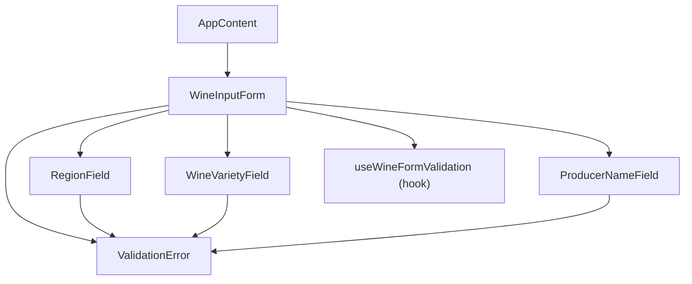
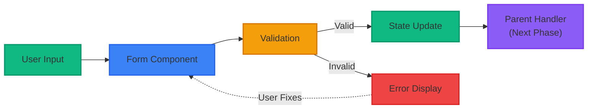

# Phase 1.2: Core Input Form - Detailed Specification

## Overview

Phase 1.2 establishes the foundational user input system for Winette, allowing winemakers to enter essential wine
details that will later drive AI-powered label generation. This phase focuses on creating a robust, validated form
system with an intuitive user experience.

## Goals

- Create a user-friendly form for entering wine information
- Implement comprehensive validation with helpful error messages
- Establish a scalable form architecture for future expansion
- Ensure accessibility and internationalization support
- Integrate with existing backend infrastructure

## Wireframe Design

```text
┌────────────────────────────────────────────────────────────┐
│                      Winette                               │
│             AI-Powered Wine Label Designer                 │
│                                                [Language]  │
├────────────────────────────────────────────────────────────┤
│                                                            │
│    Design Professional Wine Labels in Minutes              │
│    Enter your wine details below to get started            │
│                                                            │
│ ┌────────────────────────────────────────────────────────┐ │
│ │                Create Your Wine Label                  │ │
│ │                                                        │ │
│ │  Region/Appellation *                                  │ │
│ │  ┌──────────────────────────────────────────────────┐  │ │
│ │  │ e.g., Bordeaux, Napa Valley                      │  │ │
│ │  └──────────────────────────────────────────────────┘  │ │
│ │  ⚠ Region is required                                  │ │
│ │                                                        │ │
│ │  Wine Variety (optional)                               │ │
│ │  ┌──────────────────────────────────────────────────┐  │ │
│ │  │ e.g., Cabernet Sauvignon, Chardonnay             │  │ │
│ │  └──────────────────────────────────────────────────┘  │ │
│ │                                                        │ │
│ │  Producer Name *                                       │ │
│ │  ┌──────────────────────────────────────────────────┐  │ │
│ │  │ Your winery or producer name                     │  │ │
│ │  └──────────────────────────────────────────────────┘  │ │
│ │  ⚠ Producer name is required                           │ │
│ │                                                        │ │
│ │        ┌─────────────────┐  ┌─────────────────┐        │ │
│ │        │      Clear      │  │    Continue     │        │ │
│ │        └─────────────────┘  └─────────────────┘        │ │
│ └────────────────────────────────────────────────────────┘ │
│                                                            │
│  © 2024 Winette. Empowering winemakers with AI-assisted..  │
└────────────────────────────────────────────────────────────┘
```

## Component Architecture

### Component Hierarchy (Mermaid)



### 1. Form Components

#### `WineInputForm.tsx`

Main container component that orchestrates the form logic.

```typescript
interface WineInputFormData {
  region: string;
  wineVariety?: string;
  producerName: string;
}

interface WineInputFormProps {
  onSubmit: (data: WineInputFormData) => void;
  initialData?: Partial<WineInputFormData>;
}
```

Key responsibilities:

- Form state management using React Hook Form
- Validation orchestration
- Submit handling
- Error display coordination

#### `RegionField.tsx`

Specialized input for region/appellation with autocomplete support.

```typescript
interface RegionFieldProps {
  value: string;
  onChange: (value: string) => void;
  error?: string;
  onBlur: () => void;
}
```

Features:

- Autocomplete from known wine regions
- Fuzzy search capability
- Custom region entry allowed
- Required field validation

#### `WineVarietyField.tsx`

Optional field for grape variety with suggestions.

```typescript
interface WineVarietyFieldProps {
  value?: string;
  onChange: (value: string) => void;
  error?: string;
  onBlur: () => void;
}
```

Features:

- Autocomplete from common varieties
- Multi-variety support (future enhancement)
- Optional field indicator

#### `ProducerNameField.tsx`

Simple text input for winery/producer name.

```typescript
interface ProducerNameFieldProps {
  value: string;
  onChange: (value: string) => void;
  error?: string;
  onBlur: () => void;
}
```

Features:

- Standard text input
- Required field validation
- Character limit (100 chars)

### 2. Validation Components

#### `ValidationError.tsx`

Consistent error message display component.

```typescript
interface ValidationErrorProps {
  message: string;
  fieldId: string;
}
```

### 3. Utility Hooks

#### `useWineFormValidation.ts`

Custom hook for form validation logic.

```typescript
interface ValidationRules {
  region: {
    required: boolean;
    minLength: number;
    pattern?: RegExp;
  };
  producerName: {
    required: boolean;
    maxLength: number;
  };
  wineVariety: {
    maxLength: number;
  };
}
```

## Data Flow

### Data Flow Diagram (Mermaid)



## Validation Rules

### Region/Appellation

- **Required**: Yes
- **Min Length**: 2 characters
- **Max Length**: 100 characters
- **Pattern**: Letters, spaces, hyphens, apostrophes
- **Examples**: "Bordeaux", "Napa Valley", "Côtes du Rhône"

### Wine Variety

- **Required**: No
- **Max Length**: 100 characters
- **Pattern**: Letters, spaces, hyphens
- **Examples**: "Cabernet Sauvignon", "Pinot Noir", "Riesling"

### Producer Name

- **Required**: Yes
- **Min Length**: 2 characters
- **Max Length**: 100 characters
- **Pattern**: Alphanumeric, spaces, common punctuation
- **Examples**: "Château Margaux", "Silver Oak Cellars"

## State Management

Using React Hook Form for form state management:

```typescript
const {
  register,
  handleSubmit,
  formState: { errors, isSubmitting },
  reset,
  watch,
} = useForm<WineInputFormData>({
  mode: "onBlur",
  defaultValues: initialData,
});
```

## Error Handling

### Field-Level Errors

- Display immediately on blur
- Clear on valid input
- Accessible error messages with ARIA attributes

### Form-Level Errors

- Network errors
- Server validation errors
- Rate limiting feedback

## Internationalization

### New Translation Keys

```json
{
  "wineForm": {
    "title": "Create Your Wine Label",
    "fields": {
      "region": {
        "label": "Region/Appellation",
        "placeholder": "e.g., Bordeaux, Napa Valley",
        "required": "Region is required",
        "minLength": "Region must be at least 2 characters",
        "invalid": "Please enter a valid region name"
      },
      "wineVariety": {
        "label": "Wine Variety",
        "placeholder": "e.g., Cabernet Sauvignon, Chardonnay",
        "optional": "(optional)",
        "invalid": "Please enter a valid variety name"
      },
      "producerName": {
        "label": "Producer Name",
        "placeholder": "Your winery or producer name",
        "required": "Producer name is required",
        "minLength": "Producer name must be at least 2 characters",
        "maxLength": "Producer name cannot exceed 100 characters"
      }
    },
    "actions": {
      "clear": "Clear",
      "continue": "Continue",
      "clearConfirm": "Are you sure you want to clear the form?"
    },
    "status": {
      "submitting": "Processing...",
      "success": "Form submitted successfully"
    }
  }
}
```

## Accessibility Requirements

- All form fields must have proper labels
- Error messages connected via aria-describedby
- Keyboard navigation support
- Focus management on error
- Screen reader announcements for state changes
- Proper form landmark with descriptive heading

## Styling Approach

Using Vanilla Extract for consistent styling:

```typescript
// WineInputForm.css.ts
export const form = style({
  maxWidth: "600px",
  margin: "0 auto",
  padding: vars.space.lg,
});

export const fieldGroup = style({
  marginBottom: vars.space.md,
});

export const label = style({
  display: "block",
  marginBottom: vars.space.xs,
  fontWeight: "medium",
});

export const input = style({
  width: "100%",
  padding: vars.space.sm,
  borderRadius: vars.radius.sm,
  border: `1px solid ${vars.colors.border}`,
  selectors: {
    "&:focus": {
      outline: `2px solid ${vars.colors.primary}`,
      outlineOffset: "2px",
    },
    '&[aria-invalid="true"]': {
      borderColor: vars.colors.error,
    },
  },
});
```

## Integration Points

### Backend API Extension

No immediate backend changes required. The form will collect data that will be sent to future endpoints in Phase 1.3+.

### Parent Component Integration

The form will be integrated into `AppContent.tsx`, replacing the current placeholder content.

```typescript
// In AppContent.tsx
const handleWineFormSubmit = (data: WineInputFormData) => {
  // Store in context or state for next phase
  // Navigate to style selection (Phase 1.3)
};
```

## Testing Strategy

### Unit Tests

- Form validation logic
- Individual field components
- Error state handling
- Accessibility attributes

### Integration Tests

- Form submission flow
- Validation feedback
- Clear/reset functionality
- Keyboard navigation

### E2E Tests

- Complete form flow
- Error recovery
- Browser compatibility

## Performance Considerations

- Debounced autocomplete searches
- Lazy load suggestion data
- Memoized validation functions
- Optimistic UI updates

### Debounced Autocomplete Implementation Plan

#### Technical Approach

The autocomplete functionality for RegionField and WineVarietyField will use a combination of:

1. **Debounced Search**: 300ms debounce delay to avoid excessive API calls
2. **React Transitions**: For smooth UI updates and loading states
3. **Suspense Integration**: Coordinate with React's concurrent features
4. **Optimistic Caching**: Local storage of frequently used suggestions

#### Implementation Details

##### 1. Custom Hook: `useAutocompleteField`

```typescript
interface UseAutocompleteFieldOptions {
  searchFn: (query: string) => Promise<string[]>;
  debounceMs?: number;
  minChars?: number;
}

export function useAutocompleteField({
  searchFn,
  debounceMs = 300,
  minChars = 2,
}: UseAutocompleteFieldOptions) {
  const [isPending, startTransition] = useTransition();
  const [query, setQuery] = useState("");
  const [suggestions, setSuggestions] = useState<string[]>([]);
  const [isOpen, setIsOpen] = useState(false);

  // Debounced search effect
  useEffect(() => {
    if (query.length < minChars) {
      setSuggestions([]);
      return;
    }

    const timeoutId = setTimeout(() => {
      startTransition(async () => {
        try {
          const results = await searchFn(query);
          setSuggestions(results);
          setIsOpen(results.length > 0);
        } catch (error) {
          console.error("Autocomplete search failed:", error);
          setSuggestions([]);
        }
      });
    }, debounceMs);

    return () => clearTimeout(timeoutId);
  }, [query, searchFn, debounceMs, minChars]);

  return {
    query,
    setQuery,
    suggestions,
    isOpen,
    setIsOpen,
    isPending,
  };
}
```

##### 2. Data Sources

**Static Data with Fuzzy Search**:

```typescript
// src/frontend/data/wine-regions.ts
export const WINE_REGIONS = [
  "Bordeaux",
  "Burgundy",
  "Champagne",
  "Napa Valley",
  "Sonoma County",
  "Tuscany",
  "Rioja",
  "Douro Valley",
  // ... comprehensive list
];

// src/frontend/data/wine-varieties.ts
export const WINE_VARIETIES = [
  "Cabernet Sauvignon",
  "Merlot",
  "Pinot Noir",
  "Chardonnay",
  "Sauvignon Blanc",
  "Riesling",
  // ... comprehensive list
];
```

**Fuzzy Search Implementation**:

```typescript
import Fuse from "fuse.js";

export function createFuzzySearch<T>(
  items: T[],
  options: Fuse.IFuseOptions<T>
) {
  const fuse = new Fuse(items, {
    threshold: 0.3,
    includeScore: true,
    ...options,
  });

  return (query: string): T[] => {
    return fuse.search(query).map((result) => result.item);
  };
}
```

##### 3. Component Integration

**RegionField with Autocomplete**:

```typescript
export function RegionField({
  value,
  onChange,
  error,
  onBlur,
}: RegionFieldProps) {
  const searchRegions = useMemo(
    () => createFuzzySearch(WINE_REGIONS, { keys: ["name"] }),
    []
  );

  const { query, setQuery, suggestions, isOpen, setIsOpen, isPending } =
    useAutocompleteField({
      searchFn: async (q) => searchRegions(q).slice(0, 10),
    });

  // Component implementation with dropdown...
}
```

##### 4. Performance Optimizations

1. **Virtual Scrolling**: For large suggestion lists

```typescript
import { useVirtual } from "@tanstack/react-virtual";
```

1. **Memoization**: Cache search results

```typescript
const memoizedSearch = useMemo(
  () => memoize(searchFn, { maxSize: 100 }),
  [searchFn]
);
```

1. **Lazy Data Loading**:

```typescript
// Load region data only when component mounts
const regionsPromise = lazy(() => import("./data/wine-regions"));
```

##### 5. Accessibility Features

- **ARIA Attributes**: Proper combobox pattern
- **Keyboard Navigation**: Arrow keys, Enter, Escape
- **Screen Reader Announcements**: Live regions for results

```typescript
<div
  role="combobox"
  aria-expanded={isOpen}
  aria-owns="autocomplete-listbox"
  aria-haspopup="listbox"
>
  <input
    aria-autocomplete="list"
    aria-controls="autocomplete-listbox"
    aria-activedescendant={activeId}
    {...inputProps}
  />
</div>
```

##### 6. Loading States with React Transitions

```typescript
{
  isPending ? (
    <div className={styles.loadingIndicator}>
      <Spinner size="small" />
    </div>
  ) : (
    suggestions.length > 0 && (
      <SuggestionsList suggestions={suggestions} onSelect={handleSelect} />
    )
  );
}
```

#### Autocomplete Testing Strategy

1. **Unit Tests**: Debounce timing, search accuracy
2. **Integration Tests**: Component interaction
3. **Performance Tests**: Response time under load
4. **Accessibility Tests**: Keyboard navigation, screen reader

#### Migration Plan

1. Implement `useAutocompleteField` hook
2. Create fuzzy search utilities
3. Update RegionField component
4. Update WineVarietyField component
5. Add comprehensive tests
6. Performance profiling and optimization

## Future Enhancements (Post-1.2)

- Region hierarchy (Country → Region → Sub-region)
- Wine variety combinations
- Producer logo upload
- Form data persistence
- Smart defaults based on region

## Tasks Breakdown

### Component Development

1. [ ] Create `WineInputForm` container component
2. [ ] Implement `RegionField` with autocomplete
3. [ ] Build `WineVarietyField` component
4. [ ] Create `ProducerNameField` component
5. [ ] Develop `ValidationError` component
6. [ ] Create form validation hook

### Data & Utilities

1. [ ] Create wine regions data file
2. [ ] Build grape varieties data file
3. [ ] Implement fuzzy search utility
4. [ ] Create form validation schemas

### Styling

1. [ ] Design form layout styles
2. [ ] Create field component styles
3. [ ] Style error states
4. [ ] Implement responsive design

### Integration

1. [ ] Integrate form into AppContent
2. [ ] Wire up form state management
3. [ ] Connect to app navigation flow
4. [ ] Update main app state

### Testing

1. [ ] Write unit tests for components
2. [ ] Create integration test suite
3. [ ] Add accessibility tests
4. [ ] Implement Storybook stories

### Documentation & Polish

1. [ ] Update TypeScript types
2. [ ] Add JSDoc comments
3. [ ] Create form usage documentation
4. [ ] Performance optimization pass

## Success Criteria

- [ ] Users can enter wine details with clear guidance
- [ ] Validation provides helpful, immediate feedback
- [ ] Form is fully accessible with keyboard and screen readers
- [ ] All text is internationalized
- [ ] Form data is properly typed and validated
- [ ] Components follow project coding standards
- [ ] 100% test coverage for critical paths
- [ ] Storybook stories showcase all states

## Estimated Timeline

- Component Development: 2-3 days
- Styling & Polish: 1 day
- Testing & Documentation: 1-2 days
- **Total: 4-6 days**

## Dependencies

- React Hook Form for form management
- Vanilla Extract for styling
- React Testing Library for tests
- No new backend endpoints required

## Next Steps

After Phase 1.2 completion, the form data will flow into:

- Phase 1.3: Style Selection System
- Phase 1.4: Text-Only Label Preview
- Phase 1.5: Additional Fields (vintage, alcohol content, wine name)
