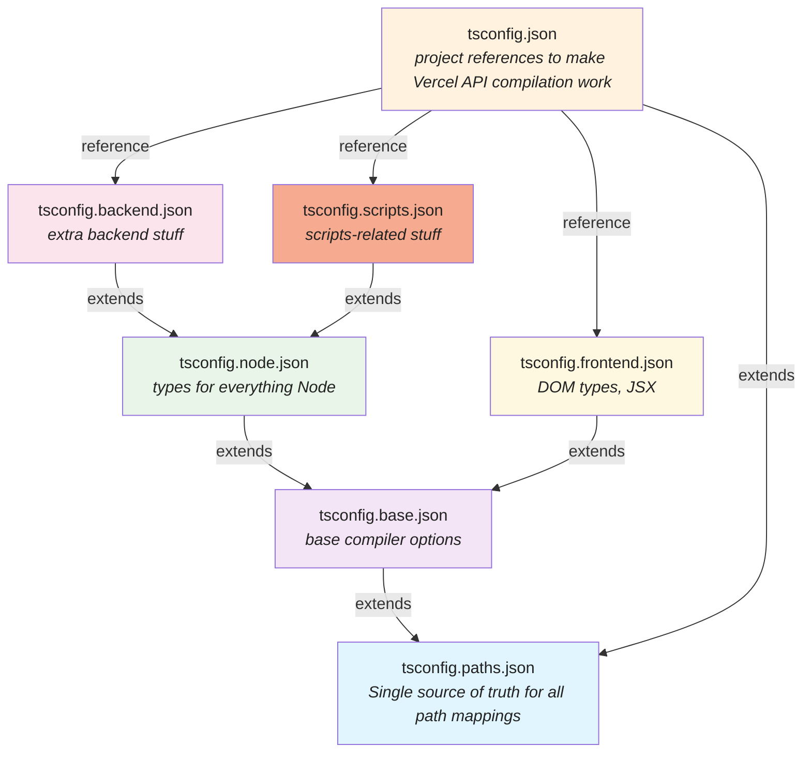

# TypeScript Configuration Architecture

This document explains how the TypeScript configuration is structured in the Winette project to support both
frontend and backend development with proper path mappings and project references.

## Overview

The project uses a sophisticated TypeScript setup that provides:

- ✅ Single source of truth for path mappings
- ✅ Proper separation between frontend and backend contexts
- ✅ Vercel-compatible API compilation
- ✅ Cursor IDE intellisense for both environments
- ✅ TypeScript project references for incremental builds

## Configuration Architecture



## File Purposes

### Core Configuration Files

**`tsconfig.paths.json`** - The single source of truth for all path mappings

- Contains all `#backend/*`, `#components/*`, `#types/*`, etc. mappings
- Inherited by all other configurations
- **This is the only file you need to edit when adding/removing path mappings**

**`tsconfig.base.json`** - Shared base configuration

- Extends `tsconfig.paths.json` to inherit path mappings
- Contains common TypeScript compiler options (strict mode, target, etc.)
- Used as foundation for both frontend and backend configs

**`tsconfig.json`** - Root configuration for Cursor IDE and Vercel

- Extends `tsconfig.paths.json` for Vercel API compilation
- Contains **project references** that connect to frontend and backend configs
- Enables Cursor to understand both frontend and backend contexts

### Environment-Specific Configurations

**`tsconfig.frontend.json`** - Frontend-specific settings

- Extends `tsconfig.base.json` (which includes path mappings)
- Adds DOM types, JSX support, Vite client types
- Uses `composite: true` for project references
- Includes only `src/frontend/**/*` files

**`tsconfig.node.json`** - Node.js base configuration

- Extends `tsconfig.base.json` (which includes path mappings)
- Adds Node.js types and module resolution
- Foundation for backend configuration

**`tsconfig.backend.json`** - Backend-specific settings

- Extends `tsconfig.node.json` → `tsconfig.base.json` → `tsconfig.paths.json`
- Uses `composite: true` for project references
- Includes `api/**/*` and `src/backend/**/*` files

**`tsconfig.scripts.json`** - Scripts and configuration files

- Extends `tsconfig.node.json` → `tsconfig.base.json` → `tsconfig.paths.json`
- Uses `composite: true` for project references
- Includes `vite.config.ts`, `*.config.*` files, and `scripts/**/*`
- Provides proper TypeScript support for build scripts and configuration files

## Project References System

The root `tsconfig.json` uses TypeScript's project references feature to connect different configurations:

```json
{
  "references": [
    { "path": "./tsconfig.frontend.json" },
    { "path": "./tsconfig.backend.json" },
    { "path": "./tsconfig.scripts.json" }
  ]
}
```

This enables:

- **Incremental compilation** - Only changed projects are rebuilt
- **Cross-project type checking** - Projects can reference each other
- **IDE context switching** - Cursor knows which config to use for each file
- **Build orchestration** - `tsc --build` compiles projects in dependency order

## Path Mappings

All path mappings are defined once in `tsconfig.paths.json`:

```json
{
  "compilerOptions": {
    "baseUrl": ".",
    "paths": {
      "#backend/*": ["./src/backend/*"],
      "#components/*": ["./src/frontend/components/*"],
      "#types/*": ["./src/frontend/types/*"],
      "#utils/*": ["./src/frontend/utils/*"],
      "#hooks/*": ["./src/frontend/hooks/*"],
      "#styles/*": ["./src/frontend/styles/*"],
      "#i18n/*": ["./src/frontend/i18n/*"],
      "#i18n": ["./src/frontend/i18n/index.ts"],
      "#lib/*": ["./src/frontend/lib/*"]
    }
  }
}
```

These mappings are automatically available in:

- ✅ Frontend code (via inheritance chain)
- ✅ Backend code (via inheritance chain)
- ✅ API endpoints (via root config extension)
- ✅ Cursor IDE intellisense
- ✅ Vercel compilation

## How Cursor IDE Integration Works

Cursor automatically detects the project structure through:

1. **Root `tsconfig.json`** - Provides overall project context and path mappings
2. **Project references** - Tell Cursor about frontend and backend sub-projects
3. **File location matching** - Files are matched to configs based on `include` patterns:
   - `src/frontend/**/*` → uses `tsconfig.frontend.json`
   - `api/**/*` and `src/backend/**/*` → uses `tsconfig.backend.json`
   - `vite.config.ts`, `*.config.*`, and `scripts/**/*` → uses `tsconfig.scripts.json`

This means when you edit frontend code, you get React/DOM types and frontend path mappings. When you edit
backend code, you get Node.js types and backend path mappings. When you edit scripts or configuration files,
you get Node.js types optimized for build tooling.

## How Vercel API Compilation Works

Vercel's TypeScript compiler uses the root `tsconfig.json` for API files in the `api/` directory. Since this config:

- Extends `tsconfig.paths.json` for path mappings
- Includes proper base URL configuration

The API endpoints can successfully import from `#backend/*` paths and compile correctly.

## Adding New Path Mappings

To add a new path mapping:

1. **Edit only `tsconfig.paths.json`**
2. Add your new mapping to the `paths` object
3. All other configurations automatically inherit the new mapping

Example:

```json
{
  "compilerOptions": {
    "paths": {
      // ... existing mappings
      "#shared/*": ["./src/shared/*"] // ← Add here
    }
  }
}
```

## Benefits of This Architecture

### Developer Experience

- **Single point of maintenance** for path mappings
- **Consistent intellisense** across all environments
- **Fast incremental builds** via project references
- **Context-aware** type checking

### Build System

- **Vercel compatibility** for API compilation
- **Parallel builds** for frontend/backend
- **Dependency tracking** between projects
- **Clean separation** of concerns

### Maintainability

- **DRY principle** - no duplicate configurations
- **Clear inheritance chain** - easy to understand and debug
- **Modular structure** - each config has a single responsibility
- **Version control friendly** - changes are localized

## Troubleshooting

### Path mapping not working?

1. Check if it's defined in `tsconfig.paths.json`
2. Verify the inheritance chain is correct
3. Restart Cursor/TypeScript server

### Cursor not recognizing project structure?

1. Ensure project references are in root `tsconfig.json`
2. Check that `composite: true` is set in referenced configs
3. Verify `include` patterns match your file locations

### Vercel API compilation failing?

1. Confirm root `tsconfig.json` extends `tsconfig.paths.json`
2. Check that API files are using correct import paths
3. Verify base URL is set correctly

## Related Files

- `package.json` - Contains Node.js import mappings that complement TypeScript paths
- `vite.config.ts` - Frontend bundler configuration
- `vercel.json` - Deployment configuration for API endpoints
